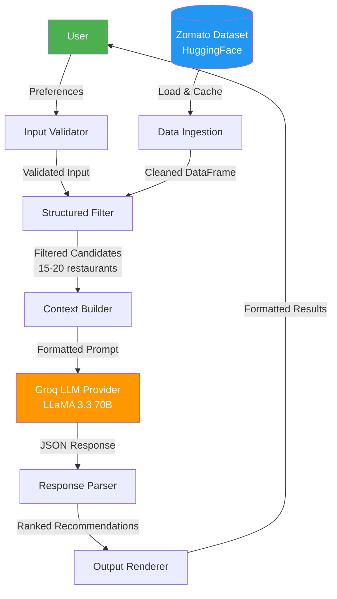
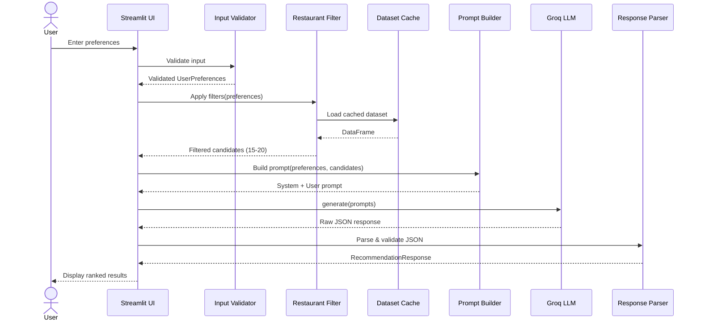

# Architecture: AI-Powered Restaurant Recommendation System

> Derived from the [Problem Statement](context.md)

---

## 1. High-Level Overview

The system is a three-tier application that combines **structured restaurant data** with an **LLM-powered recommendation engine** to deliver personalized, explainable restaurant suggestions.

```
┌─────────────────────────────────────────────────────────────────┐
│                     PRESENTATION LAYER                         │
│          (Streamlit Web UI / REST API / CLI)                   │
└──────────────────────────┬──────────────────────────────────────┘
                           │  User preferences
                           ▼
┌─────────────────────────────────────────────────────────────────┐
│                     APPLICATION LAYER                          │
│  ┌──────────────┐  ┌──────────────────┐  ┌─────────────────┐   │
│  │ Input        │→ │ Filter &         │→ │ LLM Recommender │   │
│  │ Validator    │  │ Integration Layer│  │ Engine          │   │
│  └──────────────┘  └──────────────────┘  └─────────────────┘   │
└──────────────────────────┬──────────────────────────────────────┘
                           │
                           ▼
┌─────────────────────────────────────────────────────────────────┐
│                        DATA LAYER                              │
│  ┌───────────────────┐          ┌──────────────────────────┐   │
│  │ Zomato Dataset    │          │ LLM Provider             │   │
│  │ (HuggingFace /    │          │ (Groq Cloud API)         │   │
│  │  Local CSV/Parquet)│          │                          │   │
│  └───────────────────┘          └──────────────────────────┘   │
└─────────────────────────────────────────────────────────────────┘
```

---

## 2. Component Architecture

### 2.1 Data Ingestion Module

**Responsibility:** Load, clean, and cache the Zomato restaurant dataset.

| Aspect          | Detail                                                                                  |
|-----------------|-----------------------------------------------------------------------------------------|
| **Source**      | [ManikaSaini/zomato-restaurant-recommendation](https://huggingface.co/datasets/ManikaSaini/zomato-restaurant-recommendation) (Hugging Face) |
| **Format**      | CSV / Parquet via `datasets` library                                                    |
| **Preprocessing** | Handle missing values, normalize text (city names, cuisine tags), parse cost strings, convert ratings to floats |
| **Caching**     | Cache cleaned DataFrame locally (pickle / parquet) to avoid re-downloading              |
| **Output**      | A cleaned `pandas.DataFrame` with standardized columns                                  |

**Expected Schema (post-processing):**

| Column            | Type    | Description                          |
|-------------------|---------|--------------------------------------|
| `restaurant_name` | str     | Name of the restaurant               |
| `location`        | str     | City / area (normalized lowercase)   |
| `cuisines`        | list    | List of cuisine tags                 |
| `cost_for_two`    | float   | Average cost for two people (INR)    |
| `rating`          | float   | Aggregate rating (0.0–5.0)           |
| `votes`           | int     | Number of user votes                 |
| `restaurant_type` | str     | Dining type (Casual, Fine Dining, etc.) |
| `highlights`      | list    | Features (e.g., "Family Friendly", "Live Music") |

---

### 2.2 User Input Module

**Responsibility:** Collect, validate, and normalize user preferences.

**Input Parameters:**

| Parameter              | Type          | Validation                                     | Default       |
|------------------------|---------------|-------------------------------------------------|---------------|
| `location`             | str           | Must exist in dataset locations                 | *required*    |
| `budget`               | enum          | `low` / `medium` / `high`                       | `medium`      |
| `cuisine`              | str or list   | Fuzzy-matched against dataset cuisines          | `any`         |
| `min_rating`           | float         | 0.0 – 5.0                                       | `3.5`         |
| `additional_preferences` | str (free text) | Optional; forwarded to LLM as natural language | `None`        |

**Budget Mapping (configurable):**

| Budget Level | Cost Range (for two, INR) |
|-------------|---------------------------|
| `low`       | ≤ 500                     |
| `medium`    | 501 – 1500                |
| `high`      | > 1500                    |

---

### 2.3 Filter & Integration Layer

**Responsibility:** Bridge between structured data filtering and LLM prompting.

**Pipeline:**

```
User Preferences
      │
      ▼
┌─────────────────┐
│ Structured      │   SQL-like filtering on DataFrame:
│ Filter          │   - location match
│                 │   - budget range filter
│                 │   - cuisine containment check
│                 │   - min_rating threshold
└────────┬────────┘
         │  Filtered restaurants (top N, e.g., 15–20)
         ▼
┌─────────────────┐
│ Context Builder │   Serialize filtered restaurants into a
│                 │   structured text block for the LLM prompt
└────────┬────────┘
         │  Prompt string
         ▼
┌─────────────────┐
│ LLM Client      │   Send prompt → Receive ranked recommendations
└─────────────────┘
```

**Key Design Decisions:**

- **Pre-filter before LLM:** Reduces token cost and latency by passing only relevant candidates (15–20 restaurants max) instead of the entire dataset.
- **Deterministic + Generative hybrid:** Hard filters (location, budget, rating) are deterministic; ranking and explanation are delegated to the LLM.
- **Fallback strategy:** If filters return < 3 results, progressively relax constraints (e.g., widen budget range, lower min_rating) and notify the user.

---

### 2.4 Recommendation Engine (LLM)

**Responsibility:** Rank restaurants, generate explanations, and summarize choices.

#### Prompt Engineering Strategy

The prompt follows a **structured reasoning** pattern:

```
┌────────────────────────────────────────────────────────┐
│ SYSTEM PROMPT                                          │
│ - Role: Expert food critic & recommendation engine     │
│ - Instructions: Rank by relevance, explain reasoning   │
│ - Output format: JSON with rank, name, explanation     │
├────────────────────────────────────────────────────────┤
│ USER PROMPT                                            │
│ - User preferences (structured)                        │
│ - Candidate restaurants (structured table/list)        │
│ - Request: "Rank the top 5 and explain each choice"    │
└────────────────────────────────────────────────────────┘
```

**Sample System Prompt:**

```text
You are an expert restaurant recommendation assistant. Given a list of 
candidate restaurants and a user's preferences, do the following:

1. Rank the top 5 restaurants that best match the user's needs.
2. For each recommendation, provide:
   - The restaurant name
   - A brief explanation of why it's a good fit (2–3 sentences)
   - A match score (1–10)
3. End with a short summary paragraph comparing the top choices.

Respond ONLY in valid JSON with the following schema:
{
  "recommendations": [
    {
      "rank": 1,
      "restaurant_name": "...",
      "cuisine": "...",
      "rating": 4.5,
      "cost_for_two": 800,
      "explanation": "...",
      "match_score": 9
    }
  ],
  "summary": "..."
}
```

**LLM Provider Abstraction:**

```python
# Groq-powered LLM client using the Groq Python SDK
from groq import Groq

class GroqProvider:
    def __init__(self, api_key: str, model: str = "llama-3.3-70b-versatile"):
        self.client = Groq(api_key=api_key)
        self.model = model

    def generate(self, system_prompt: str, user_prompt: str) -> str:
        response = self.client.chat.completions.create(
            model=self.model,
            messages=[
                {"role": "system", "content": system_prompt},
                {"role": "user", "content": user_prompt},
            ],
            temperature=0.7,
            max_tokens=1024,
            response_format={"type": "json_object"},
        )
        return response.choices[0].message.content
```

**Configuration:**

| Setting         | Default                       | Notes                                         |
|-----------------|-------------------------------|-----------------------------------------------|
| `provider`      | `groq`                        | Groq Cloud API                                |
| `model`         | `llama-3.3-70b-versatile`     | Fast inference via Groq; ideal for ranking    |
| `temperature`   | `0.7`                         | Balance creativity vs. consistency            |
| `max_tokens`    | `1024`                        | Sufficient for top-5 + explanations           |
| `top_k`         | `5`                           | Number of recommendations to return           |

---

### 2.5 Output Display Module

**Responsibility:** Parse LLM response and render results.

**Output Format:**

```
╔══════════════════════════════════════════════════════════╗
║  🏆 #1  Restaurant Name                                ║
║  ─────────────────────────────────────────────────────  ║
║  🍽️  Cuisine: Italian, Continental                      ║
║  ⭐  Rating: 4.6 / 5.0                                  ║
║  💰  Cost for Two: ₹1,200                               ║
║  🎯  Match Score: 9 / 10                                ║
║                                                         ║
║  💬  "This restaurant is an excellent match because..."  ║
╚══════════════════════════════════════════════════════════╝
```

**Rendering Targets:**

| Target      | Library / Framework   | Notes                        |
|-------------|----------------------|------------------------------|
| Web UI      | Streamlit            | Primary interface            |
| CLI         | Rich (Python)        | Developer / demo mode        |
| REST API    | FastAPI              | For programmatic integration |

---

## 3. Data Flow Diagram



---

## 4. Technology Stack

| Layer               | Technology                          | Rationale                                      |
|---------------------|--------------------------------------|------------------------------------------------|
| **Language**        | Python 3.10+                        | Rich ML/AI ecosystem, rapid prototyping        |
| **Data Handling**   | pandas, datasets (HuggingFace)      | Standard for tabular data & HF integration     |
| **LLM Integration** | groq (Python SDK)                     | Ultra-fast inference via Groq Cloud API        |
| **Web Framework**   | Streamlit                           | Rapid UI development, built-in widgets         |
| **API Framework**   | FastAPI                             | Optional REST endpoint for programmatic access |
| **CLI Rendering**   | Rich                                | Beautiful terminal output                      |
| **Config Mgmt**     | python-dotenv, pydantic-settings    | Type-safe configuration                        |
| **Testing**         | pytest, pytest-mock                 | Unit + integration tests                       |
| **Linting**         | ruff                                | Fast Python linter                             |

---

## 5. Project Structure

```
Zomoto Recommendation system/
├── docs/
│   ├── context.md                # Problem statement
│   ├── architecture.md           # This document
│   └── ProblemStatement.txt      # Original problem statement
├── src/
│   ├── __init__.py
│   ├── main.py                   # Application entry point
│   ├── config.py                 # Settings & environment config
│   ├── data/
│   │   ├── __init__.py
│   │   ├── ingestion.py          # Dataset loading & preprocessing
│   │   └── cache.py              # Local caching utilities
│   ├── models/
│   │   ├── __init__.py
│   │   ├── schemas.py            # Pydantic models (UserPrefs, Restaurant, Recommendation)
│   │   └── enums.py              # Budget levels, cuisine categories
│   ├── filters/
│   │   ├── __init__.py
│   │   └── restaurant_filter.py  # Structured filtering logic
│   ├── llm/
│   │   ├── __init__.py
│   │   ├── groq_provider.py      # Groq Cloud API implementation
│   │   └── prompt_builder.py     # Prompt construction & templates
│   ├── engine/
│   │   ├── __init__.py
│   │   └── recommender.py        # Orchestrator: filter → prompt → LLM → parse
│   └── ui/
│       ├── __init__.py
│       ├── streamlit_app.py      # Streamlit web interface
│       └── cli.py                # CLI interface (Rich)
├── tests/
│   ├── __init__.py
│   ├── test_ingestion.py
│   ├── test_filters.py
│   ├── test_prompt_builder.py
│   ├── test_recommender.py
│   └── conftest.py               # Shared fixtures
├── .env.example                  # Template for API keys & config
├── requirements.txt              # Python dependencies
├── pyproject.toml                # Project metadata & tool config
└── README.md                     # Setup & usage instructions
```

---

## 6. API Contracts

### 6.1 Internal: `UserPreferences` Schema

```python
class UserPreferences(BaseModel):
    location: str                          # e.g., "Delhi"
    budget: BudgetLevel = BudgetLevel.MEDIUM  # low | medium | high
    cuisine: Optional[str] = None          # e.g., "Italian"
    min_rating: float = Field(3.5, ge=0.0, le=5.0)
    additional_preferences: Optional[str] = None  # free-text
```

### 6.2 Internal: `Recommendation` Schema

```python
class Recommendation(BaseModel):
    rank: int
    restaurant_name: str
    cuisine: str
    rating: float
    cost_for_two: float
    explanation: str
    match_score: int = Field(ge=1, le=10)

class RecommendationResponse(BaseModel):
    recommendations: list[Recommendation]
    summary: str
```

### 6.3 REST API (FastAPI) — Optional

| Endpoint                    | Method | Request Body         | Response Body              |
|-----------------------------|--------|----------------------|----------------------------|
| `POST /api/recommend`       | POST   | `UserPreferences`    | `RecommendationResponse`   |
| `GET /api/locations`        | GET    | —                    | `list[str]`                |
| `GET /api/cuisines`         | GET    | —                    | `list[str]`                |
| `GET /api/health`           | GET    | —                    | `{"status": "ok"}`         |

---

## 7. Sequence Diagram



---

## 8. Non-Functional Requirements

### 8.1 Performance

| Metric                  | Target          | Strategy                                   |
|-------------------------|------------------|--------------------------------------------|
| Dataset load time       | < 2s (cached)    | Local parquet cache after first download    |
| Filter execution        | < 100ms          | Vectorized pandas operations               |
| LLM response time       | < 3s             | Groq's LPU inference engine (ultra-low latency) |
| End-to-end latency      | < 8s             | Pre-filter to minimize prompt size          |

### 8.2 Reliability

- **Graceful degradation:** If LLM is unavailable, return filtered results without AI explanations.
- **Retry logic:** Exponential backoff (3 retries) for transient LLM API failures.
- **Input validation:** Reject invalid inputs early with clear error messages.

### 8.3 Security

- **API keys** stored in `.env`, never committed to version control.
- **Input sanitization** to prevent prompt injection via `additional_preferences`.
- `.gitignore` includes `.env`, `__pycache__`, cached data files.

### 8.4 Extensibility

- **New LLM providers** added by implementing the `LLMProvider` abstract class.
- **New UI targets** (e.g., Discord bot, Telegram) added without modifying core logic.
- **Dataset swap** possible by implementing a data ingestion adapter.

### 8.5 Observability

- **Structured logging** via Python `logging` module (JSON format for production).
- **Prompt/response logging** (opt-in) for debugging and prompt iteration.
- **Token usage tracking** per request for cost monitoring.

---

## 9. Environment Configuration

```bash
# .env.example
# ─── LLM Provider (Groq) ───
GROQ_API_KEY=your-groq-api-key        # Get from https://console.groq.com

# ─── Model Settings ───
LLM_MODEL=llama-3.3-70b-versatile     # Groq-hosted model
LLM_TEMPERATURE=0.7
LLM_MAX_TOKENS=1024
TOP_K_RECOMMENDATIONS=5

# ─── Data ───
DATASET_CACHE_DIR=./data/cache
HUGGINGFACE_DATASET=ManikaSaini/zomato-restaurant-recommendation

# ─── App ───
APP_PORT=8501
LOG_LEVEL=INFO
```

---

## 10. Development Phases

| Phase | Milestone                        | Deliverables                                         |
|-------|----------------------------------|------------------------------------------------------|
| **1** | Data Pipeline                    | Ingestion, cleaning, caching, schema validation      |
| **2** | Core Logic                       | Filtering, prompt builder, LLM integration           |
| **3** | Recommendation Engine            | Orchestrator, response parsing, fallback handling     |
| **4** | UI & Display                     | Streamlit app with full input form + result cards     |
| **5** | Polish & Testing                 | Unit tests, error handling, README, demo recording    |
| **6** | Optional Enhancements            | FastAPI endpoint, CLI mode, multi-provider support    |

---

*Last updated: 2026-06-19*
