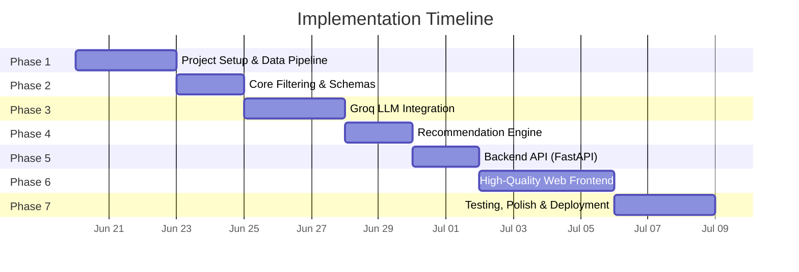
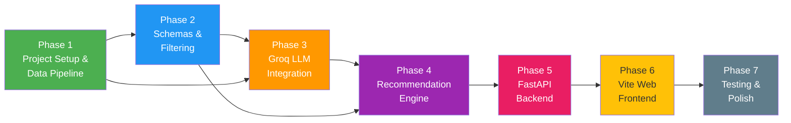

# Implementation Plan: AI-Powered Restaurant Recommendation System

> Phase-wise execution plan derived from [architecture.md](architecture.md) and [context.md](context.md)

---

## Overview

This plan breaks the full build into **7 sequential phases**, each with clearly defined goals, tasks, file deliverables, acceptance criteria, and estimated effort. We have transitioned from a monolithic architecture to a decoupled API + Frontend architecture to ensure a stunning, high-quality user experience.



---

## Phase 1 — Project Setup & Data Pipeline

**Goal:** Initialize the project structure, install dependencies, and build a robust data ingestion module that loads, cleans, and caches the Zomato dataset.

### Tasks

| # | Task | File(s) | Details |
|---|------|---------|---------|
| 1.1 | Create project directory structure | All dirs under `src/` | Match the structure defined in architecture §5 |
| 1.2 | Initialize Python project | `pyproject.toml`, `requirements.txt` | Pin versions for `pandas`, `datasets`, `groq`, `fastapi`, `uvicorn`, `python-dotenv`, `pydantic` |
| 1.3 | Set up environment config | `.env.example`, `src/config.py` | Use `pydantic-settings` to load `GROQ_API_KEY`, `LLM_MODEL`, `DATASET_CACHE_DIR`, etc. |
| 1.4 | Create `.gitignore` | `.gitignore` | Exclude `.env`, `__pycache__`, `data/cache/`, `*.pyc`, `.venv/` |
| 1.5 | Build data ingestion module | `src/data/ingestion.py` | Load dataset from HuggingFace using `datasets` library |
| 1.6 | Implement preprocessing | `src/data/ingestion.py` | Handle missing values, normalize city names (lowercase/strip), parse cuisine strings into lists, convert cost/rating to numeric types |
| 1.7 | Build local caching | `src/data/cache.py` | Save cleaned DataFrame as local parquet; load from cache if exists; add `force_refresh` flag |
| 1.8 | Validate output schema | `src/data/ingestion.py` | Assert cleaned DataFrame matches expected schema (see architecture §2.1) |

### Deliverables

```
src/
├── __init__.py
├── config.py
├── data/
│   ├── __init__.py
│   ├── ingestion.py
│   └── cache.py
.env.example
.gitignore
pyproject.toml
requirements.txt
```

### Acceptance Criteria

- [x] `python -c "from src.data.ingestion import load_dataset; df = load_dataset(); print(df.shape)"` runs without error
- [x] Cleaned DataFrame has columns: `restaurant_name`, `location`, `cuisines`, `cost_for_two`, `rating`, `votes`
- [x] All numeric columns have no NaN values
- [x] Second run loads from cache (< 1s load time)
- [x] `.env.example` contains all required environment variables

---

## Phase 2 — Core Schemas & Filtering Logic

**Goal:** Define Pydantic data models and implement the structured filtering layer that narrows the dataset based on user preferences.

### Tasks

| # | Task | File(s) | Details |
|---|------|---------|---------|
| 2.1 | Define budget enum | `src/models/enums.py` | `BudgetLevel` enum: `LOW`, `MEDIUM`, `HIGH` with cost range mapping (≤500, 501–1500, >1500) |
| 2.2 | Define UserPreferences schema | `src/models/schemas.py` | Pydantic model with `location`, `budget`, `cuisine`, `min_rating`, `additional_preferences` |
| 2.3 | Define Restaurant schema | `src/models/schemas.py` | Pydantic model matching cleaned DataFrame columns |
| 2.4 | Define Recommendation schema | `src/models/schemas.py` | `Recommendation` (rank, name, cuisine, rating, cost, explanation, match_score) and `RecommendationResponse` |
| 2.5 | Implement restaurant filter | `src/filters/restaurant_filter.py` | Filter DataFrame by: location (case-insensitive match), budget range, cuisine containment, min_rating threshold |
| 2.6 | Implement constraint relaxation | `src/filters/restaurant_filter.py` | If < 3 results, progressively relax: (1) widen budget ±1 tier, (2) lower min_rating by 0.5, (3) drop cuisine filter |
| 2.7 | Add helper utilities | `src/filters/restaurant_filter.py` | `get_available_locations()`, `get_available_cuisines()` — extract unique values from dataset |

### Deliverables

```
src/
├── models/
│   ├── __init__.py
│   ├── enums.py
│   └── schemas.py
├── filters/
│   ├── __init__.py
│   └── restaurant_filter.py
```

### Acceptance Criteria

- [x] `UserPreferences(location="Delhi", budget="low")` validates successfully
- [x] `UserPreferences(location="", min_rating=6.0)` raises `ValidationError`
- [x] Filtering for "Delhi" + "low" budget + "Chinese" returns only matching restaurants
- [x] When filters return < 3 results, relaxation kicks in and logs a warning
- [x] `get_available_locations()` returns a sorted list of unique locations from the dataset

---

## Phase 3 — Groq LLM Integration

**Goal:** Build the Groq provider, prompt builder, and response parser. Verify end-to-end LLM communication.

### Tasks

| # | Task | File(s) | Details |
|---|------|---------|---------|
| 3.1 | Implement GroqProvider | `src/llm/groq_provider.py` | Initialize `Groq` client with API key; implement `generate(system_prompt, user_prompt) -> str`; use `response_format={"type": "json_object"}` |
| 3.2 | Add retry logic | `src/llm/groq_provider.py` | Exponential backoff (3 retries) for `RateLimitError`, `APIConnectionError` |
| 3.3 | Add token usage tracking | `src/llm/groq_provider.py` | Log `prompt_tokens`, `completion_tokens`, `total_tokens` from response metadata |
| 3.4 | Build system prompt template | `src/llm/prompt_builder.py` | Define the expert food critic system prompt with JSON output schema (see architecture §2.4) |
| 3.5 | Build user prompt template | `src/llm/prompt_builder.py` | Serialize user preferences + filtered restaurant list into structured text block |
| 3.6 | Build context serializer | `src/llm/prompt_builder.py` | Convert DataFrame rows → formatted string (table or numbered list) for LLM consumption |
| 3.7 | Implement response parser | `src/llm/prompt_builder.py` | Parse LLM JSON string → `RecommendationResponse` Pydantic model; handle malformed JSON gracefully |
| 3.8 | Input sanitization | `src/llm/prompt_builder.py` | Strip/escape `additional_preferences` to mitigate prompt injection |

### Deliverables

```
src/
├── llm/
│   ├── __init__.py
│   ├── groq_provider.py
│   └── prompt_builder.py
```

### Acceptance Criteria

- [x] `GroqProvider.generate()` returns valid JSON with the expected schema
- [x] Retry logic handles rate limits without crashing (testable with mock)
- [x] Token usage is logged to stdout for each request
- [x] Prompt builder correctly serializes 15 restaurants into a prompt under 2000 tokens
- [x] Malformed LLM response triggers a clear error message (not a crash)
- [x] Integration test: preferences → filter → prompt → Groq → parsed response (end-to-end)

---

## Phase 4 — Recommendation Engine (Orchestrator)

**Goal:** Wire all modules together into a single orchestrator that takes user preferences in and returns ranked recommendations out.

### Tasks

| # | Task | File(s) | Details |
|---|------|---------|---------|
| 4.1 | Build Recommender class | `src/engine/orchestrator.py` | Orchestrate: load data → validate input → filter → build prompt → call Groq → parse response |
| 4.2 | Implement `get_recommendations()` method | `src/engine/orchestrator.py` | Accept `UserPreferences`, return `RecommendationResponse` |
| 4.3 | Add graceful degradation | `src/engine/orchestrator.py` | If Groq API is down, return filtered results as-is (without AI explanations) with a warning flag |
| 4.4 | Add logging throughout | `src/engine/orchestrator.py` | Log each step: data loaded (N rows), filtered (N candidates), prompt sent, response received |
| 4.5 | Create entry point | `predict.py` | Test script to run predictions end-to-end |

### Deliverables

```
src/
├── engine/
│   ├── __init__.py
│   └── orchestrator.py
predict.py
```

### Acceptance Criteria

- [x] `RecommendationEngine().get_recommendations(UserPreferences(...))` returns a valid `RecommendationResponse`
- [x] Graceful degradation: when `GROQ_API_KEY` is invalid, returns filtered results without crash
- [x] Logs show the full pipeline trace (data → filter → prompt → LLM → parse)
- [x] `python predict.py` prints top 5 recommendations to terminal
- [x] End-to-end time < 8s (including LLM call)

---

> [!IMPORTANT]
> **User Review Required for Phases 5 & 6**
> We have pivoted from a simple Streamlit UI to a robust decoupled architecture. Phase 5 will implement the backend API, and Phase 6 will implement the high-quality interactive frontend.

## Phase 5 — Backend API (FastAPI)

**Goal:** Expose the recommendation engine via a robust, RESTful API using FastAPI.

### Tasks

| # | Task | File(s) | Details |
|---|------|---------|---------|
| 5.1 | Initialize FastAPI App | `src/api/main.py` | Create the FastAPI application, set up CORS middleware to allow frontend access |
| 5.2 | State Management | `src/api/main.py` | Initialize the `RecommendationEngine` globally so the dataset is loaded into memory only once |
| 5.3 | Define Metadata Routes | `src/api/routes.py` | Implement `GET /api/locations` and `GET /api/cuisines` utilizing `get_available_locations` and `get_available_cuisines` from the filters module |
| 5.4 | Define Recommendation Route | `src/api/routes.py` | Implement `POST /api/recommend` accepting `UserPreferences` JSON and returning the `RecommendationResponse` |
| 5.5 | Error Handling | `src/api/main.py` | Add global exception handlers to return standard JSON error responses |

### Deliverables

```
src/
├── api/
│   ├── __init__.py
│   ├── main.py
│   └── routes.py
```

### Acceptance Criteria

- [ ] FastAPI starts successfully using `uvicorn src.api.main:app --reload`
- [ ] Swagger UI is accessible at `/docs`
- [ ] `GET /api/locations` returns a list of title-cased locations.
- [ ] `POST /api/recommend` accepts JSON payload and successfully returns LLM recommendations.
- [ ] CORS is properly configured to accept requests from the local Vite dev server.

---

## Phase 6 — High-Quality Web Frontend (Vite)

**Goal:** Build a stunning, interactive frontend with high-end aesthetics (glassmorphism, vibrant colors, dark mode, animations) utilizing Vite.

### Tasks

| # | Task | File(s) | Details |
|---|------|---------|---------|
| 6.1 | Initialize Frontend Project | `frontend/` | Use `npx create-vite@latest frontend --template vanilla` (or react, based on user preference) |
| 6.2 | Base Styling & Variables | `frontend/style.css` | Implement global CSS variables for a premium dark mode, glassmorphism effects, gradients, and typography (Google Fonts e.g. Inter/Outfit) |
| 6.3 | Build API Service | `frontend/api.js` | Create a utility to communicate with the FastAPI backend (`fetchLocations`, `fetchRecommendations`) |
| 6.4 | Layout & Sidebar Form | `frontend/index.html`, `main.js` | Create a responsive layout with a stylish sidebar for inputs (Location, Budget, Rating, Cuisine) |
| 6.5 | Loading Animations | `frontend/index.html`, `style.css` | Implement a high-quality CSS loader/spinner that displays while waiting for the LLM response |
| 6.6 | Recommendation Cards | `frontend/index.html`, `main.js` | Render results into beautiful glassmorphic cards with micro-animations on hover (e.g. slight scaling, glow effects). Display Rank, Score, Cuisine, Cost, and LLM Explanation. |

### Deliverables

```
frontend/
├── index.html
├── package.json
├── src/
│   ├── main.js
│   ├── api.js
│   └── style.css
```

### Acceptance Criteria

- [ ] Frontend successfully runs via `npm run dev`
- [ ] The UI looks extremely premium (satisfying the `<web_application_development>` system guidelines)
- [ ] Dropdowns are dynamically populated from the API
- [ ] Form submission triggers the loader, calls the API, and smoothly renders the cards upon success
- [ ] Graceful UI error states if the backend is down

---

## Phase 7 — Testing, Polish & Deployment Readiness

**Goal:** Add unit tests, improve error handling, write documentation, and prepare the project for demonstration.

### Tasks

| # | Task | File(s) | Details |
|---|------|---------|---------|
| 7.1 | Unit tests: data ingestion | `tests/test_ingestion.py` | Test loading, cleaning, schema validation, cache hit/miss |
| 7.2 | Unit tests: filtering | `tests/test_filters.py` | Test each filter dimension independently; test relaxation logic; test edge cases |
| 7.3 | Unit tests: prompt builder | `tests/test_prompt_builder.py` | Test prompt construction, context serialization, response parsing |
| 7.4 | Unit tests: recommender | `tests/test_recommender.py` | Mock Groq API; test full pipeline |
| 7.5 | Unit tests: FastAPI backend | `tests/test_api.py` | Test API endpoints using `TestClient` |
| 7.6 | Error handling audit | All `src/` files | Ensure all exceptions are caught and produce user-friendly messages |
| 7.7 | Logging configuration | `src/config.py` | Structured logging setup with configurable `LOG_LEVEL` |
| 7.8 | Write README | `README.md` | Project overview, setup instructions, usage examples, screenshots |
| 7.9 | Record demo | — | Run through the app showing 2–3 different preference combinations |

### Deliverables

```
tests/
├── __init__.py
├── conftest.py
├── test_ingestion.py
├── test_filters.py
├── test_prompt_builder.py
├── test_recommender.py
└── test_api.py
README.md
```

### Acceptance Criteria

- [ ] `pytest tests/ -v` passes all tests with 0 failures
- [ ] README contains: backend setup, frontend setup, `.env` config, run commands
- [ ] No unhandled exceptions in any code path
- [ ] Demo recording shows end-to-end flow with at least 2 different queries

---

## Dependencies Between Phases



---

## Full File Manifest

Every file to be created across all phases:

| File | Phase | Purpose |
|------|-------|---------|
| `pyproject.toml` | 1 | Project metadata & dependencies |
| `requirements.txt` | 1 | Pinned dependencies |
| `.env.example` | 1 | Environment variable template |
| `.gitignore` | 1 | Git exclusions |
| `README.md` | 7 | Project documentation |
| `src/__init__.py` | 1 | Package init |
| `src/config.py` | 1 | Settings (pydantic-settings) |
| `src/data/__init__.py` | 1 | Package init |
| `src/data/ingestion.py` | 1 | Dataset loading & preprocessing |
| `src/data/cache.py` | 1 | Local parquet caching |
| `src/models/__init__.py` | 2 | Package init |
| `src/models/enums.py` | 2 | BudgetLevel enum |
| `src/models/schemas.py` | 2 | Pydantic models |
| `src/filters/__init__.py` | 2 | Package init |
| `src/filters/restaurant_filter.py` | 2 | Filtering logic |
| `src/llm/__init__.py` | 3 | Package init |
| `src/llm/groq_provider.py` | 3 | Groq API client |
| `src/llm/prompt_builder.py` | 3 | Prompt construction & parsing |
| `src/engine/__init__.py` | 4 | Package init |
| `src/engine/orchestrator.py` | 4 | Pipeline orchestrator |
| `predict.py` | 4 | Test script |
| `src/api/__init__.py` | 5 | Package init |
| `src/api/main.py` | 5 | FastAPI application |
| `src/api/routes.py` | 5 | FastAPI endpoints |
| `frontend/index.html` | 6 | Frontend entrypoint |
| `frontend/src/main.js` | 6 | Frontend logic |
| `frontend/src/style.css` | 6 | High-quality styling |
| `tests/__init__.py` | 7 | Package init |
| `tests/conftest.py` | 7 | Shared test fixtures |
| `tests/test_ingestion.py` | 7 | Data ingestion tests |
| `tests/test_filters.py` | 7 | Filter logic tests |
| `tests/test_prompt_builder.py` | 7 | Prompt builder tests |
| `tests/test_recommender.py` | 7 | Recommender pipeline tests |
| `tests/test_api.py` | 7 | API tests |

---

## Risk Mitigation

| Risk | Impact | Mitigation |
|------|--------|------------|
| Groq API rate limits | Blocked LLM calls during development | Use mock responses for unit tests; keep candidate count ≤ 20 |
| Dataset schema changes | Breaking ingestion pipeline | Pin dataset version; add schema validation assertions |
| Malformed LLM output | Crash in response parser | Wrap parsing in try/except; return raw filtered results as fallback |
| Large dataset size | Slow startup | Parquet cache; load only required columns |
| Prompt injection via user input | Security vulnerability | Sanitize `additional_preferences`; limit input length |
| Frontend-Backend Integration | CORS issues, schema mismatch | Enforce Pydantic validation on routes, explicit CORS configuration |

---

*Last updated: 2026-06-26*
